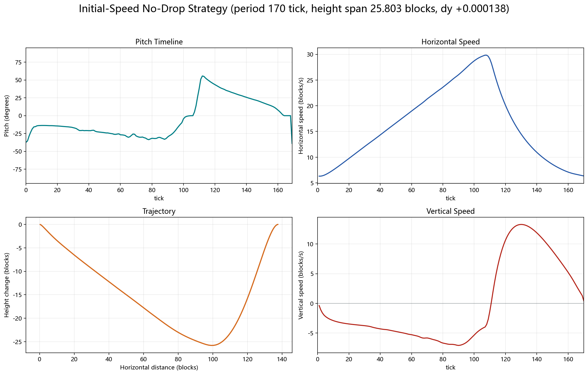
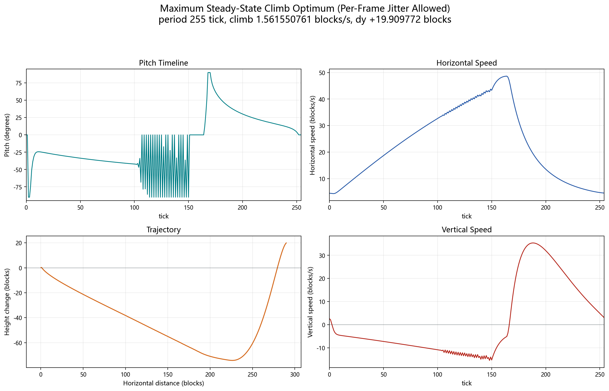
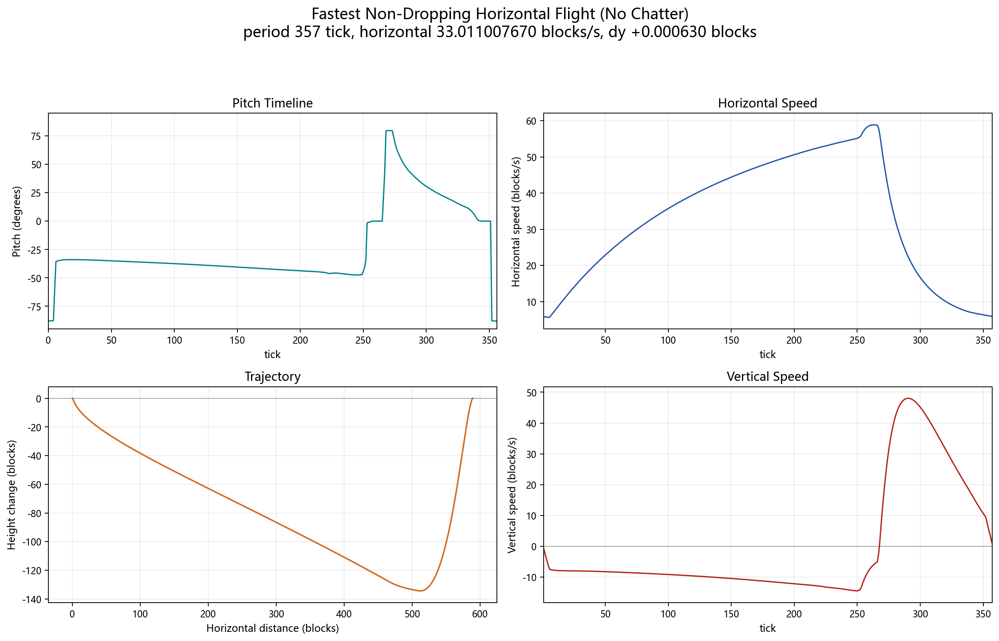

# Elytra Strategy Lab ([中文](README.zh-CN.md))

Optimized Minecraft Elytra pitch-control strategies, result data, plots, solvers, and a small Fabric client mod that applies selected pitch sequences while the player is already Elytra-flying.

The mod only changes the player's pitch angle. It does not directly edit position, velocity, durability, physics constants, or packets.

## Elytra tick model

The simulator uses a 2D version of the Java Edition Elytra tick formula with fixed yaw. Positive strategy angle means nose-up; Minecraft pitch uses the opposite sign:

```text
minecraft_pitch_degrees = -strategy_angle_degrees
```

The per-tick update is:

```text
lookH = cos(pitch)
lift = cos(pitch)^2 * min(1, |look| / 0.4)

vy += -0.08 + lift * 0.06

if (vy < 0) {
  yAccel = vy * -0.1 * lift
  vy += yAccel
  vx += yAccel
}

if (pitch < 0) {
  climb = |vx_old| * -sin(pitch) * 0.04
  vy += climb * 3.2
  vx -= climb
}

vx += (|vx_old| - vx) * 0.1
vx *= 0.9900000095367432
vy *= 0.9800000190734863
```

Sources and cross-checks:

- Minecraft Java client jar for version `26.2`, inspected locally through Fabric Loom cache.
- Fabric metadata: `https://meta.fabricmc.net/v2/versions/game` and `https://meta.fabricmc.net/v2/versions/loader/26.2`.
- Elytra behavior references: Minecraft Wiki and Yarn/LivingEntity-style mapping documentation for older mapped releases.

## Search Shape

Direct per-frame optimization finds the strongest reference solutions, but the optimum can use high-frequency pitch alternation as a legitimate discrete-time control. The repository therefore keeps two versions for the climb-rate and horizontal-speed objectives:

- an **optimum where per-frame jitter is allowed**, with no smoothness penalty;
- a **no-chatter practical version**, where real phase jumps remain instantaneous but rapid back-and-forth pitch reversals are removed.

The climb no-chatter result uses unrestricted per-frame L-BFGS-B, reversal regularization, and Java-exact coordinate refinement while limiting the cycle to four pitch-direction changes. The horizontal no-chatter result uses total-variation trend filtering, low-frequency correction, and a short monotone bridge. Neither approach globally blurs the waveform: an optimal Elytra cycle can contain real discontinuities, and those jumps are preserved. Earlier Fourier and B-spline experiments remain in `solvers/` and are discussed in [docs/solver-method.md](docs/solver-method.md).

## Current results

| Result | Summary | Data | Plot |
|---|---:|---|---|
| Minimum start height with initial speed (already smooth) | period `162 tick`, initial velocity `(0.332244, 0.079996)`, height span `25.560603`, dy `+4.31e-8` | `results/periodic-vx025-no-drop` |  |
| Maximum climb optimum (per-frame jitter allowed) | period `255 tick`, climb `1.561550761 blocks/s`, dy `+19.909772`; circular RMS delta `36.086 degrees/tick` | `results/lbfgsb-max-climb-raw` |  |
| Maximum climb, no chatter | period `254 tick`, climb `1.552981247 blocks/s`, dy `+19.722862`; unrestricted per-frame curve with four circular direction changes | `results/fastest-climb-rate` |  |
| Fastest non-dropping horizontal flight optimum (per-frame jitter allowed) | period `357 tick`, horizontal `33.022449116 blocks/s`, dy `+5.90e-8` | `results/fastest-horizontal-speed` |  |
| Fastest non-dropping horizontal flight, no chatter | period `357 tick`, horizontal `33.011007670 blocks/s`, dy `+0.000630`; only `0.03465%` slower | `results/fastest-horizontal-speed-smooth` |  |

All five headline waveforms were validated with the Java-exact `Mth.sin/cos` lookup behavior. In particular, the older continuous-trigonometry climb figure `1.562324772 blocks/s` is not used as the deployable metric: exact `+90 degrees` lies on a lookup-table boundary. The current jittery climb result stays inside that boundary and achieves `1.561550761 blocks/s` in the Java-exact model.

All deployable periodic waveforms are phase-rotated so tick `0` is the highest steady-state point. If the maximum occurs at the cycle endpoint, that endpoint is the same control phase as tick `0` of the next cycle and no array rotation is needed.

Each result folder contains:

- `strategy.json`: canonical parameters and metrics.
- `waveform.csv`: expanded per-tick pitch waveform.
- `trajectory.csv`: simulated state samples.

For direct reuse, the deployable strategy parameter files and per-tick waveforms are also mirrored under `strategies/`:

- `strategies/*/parameters.json`
- `strategies/*/waveform.csv`
- `strategies/*/best_params.csv`

## Side studies

- [Minimum time to `x=1000`, unrestricted](docs/minimum-time-x1000.md): from rest with unbounded height and per-frame control, the best validated policy arrives in `403 tick` (`20.15 s`).
- [Minimum time to `x=1000`, smooth monotone pitch](docs/minimum-time-x1000.md): requiring a C2 curve that rises monotonically from `-90` to `0 degrees` changes the result to `405 tick` (`20.25 s`).
- [Maximum instantaneous horizontal speed](docs/maximum-instantaneous-horizontal-speed.md): from the ideal vertical-terminal-dive state with unbounded height, a deterministic switching path reaches `75.196540693 blocks/s`; a smooth alternative reaches `74.444921694 blocks/s`.

These are nonperiodic research tasks rather than deployable steady-cycle strategies. The dedicated notes contain the assumptions, optimization methods, boundary checks, plots, and CSV locations.

## Web simulator

The browser simulator source is under `simulator/`. Open `simulator/index.html` directly in a browser to run it locally. It embeds selected mirrored pitch waveforms through `simulator/strategies-data.js`, with CSV loading kept as a fallback for served copies. The scene uses an x/y coordinate grid and the real simulated trail instead of random waypoint rings.

## Fabric mod

The Fabric client mod, **Elytra Optima**, is under `mod/elytra-optima`.
The author shown in the mod metadata is `hzyhhzy`. The mod icon is referenced as `assets/elytra_optima/icon.png`, with a duplicate root `icon.png` included for launcher compatibility.
The current compiled jar is checked in under `dist/elytra-optima-1.0.0.jar`.

Supported version pins:

- Minecraft `26.2`
- Fabric Loader `0.19.3`
- Fabric API `0.154.0+26.2`
- Java `25`

Controls:

- `H`: toggle Elytra Optima. Every time it is turned on, the configured default strategy is selected; the shipped default is **start +0 (>32 m)**.
- `J`: cycle strategy. The default strategy and cycle order are configurable through the Mod Menu config button, or directly in `config/elytra-optima.json`.

Default cycle order:

```text
start +0 (>32 m) -> start +2 (>35 m) -> minimum start with initial speed (25.56 m) -> height +1 (28 m span) -> no-chatter max climb (1.553 m/s) -> max-climb optimum (per-frame jitter allowed, 1.562 m/s) -> no-chatter horizontal (33.011 m/s) -> horizontal optimum (per-frame jitter allowed, 33.022 m/s)
```

All embedded mod strategies are stored as per-frame CSV resources and loop while Elytra Optima is enabled. Periodic strategies start at their highest-point phase.

## Reproducing and extending

- `solvers/segmented_sampled_optimize.cpp`: segmented Bezier optimizer for periodic horizontal speed and climb-rate searches.
- `solvers/audit_segmented_local.cpp`: local auditor/refiner for segmented periodic candidates.
- `solvers/nonperiodic_return_optimize.cpp`: nonperiodic from-rest return/gain-target optimizer.
- `solvers/lbfgsb_max_climb.py`: direct per-frame L-BFGS-B reproduction script for the raw jittery max-climb reference.
- `solvers/milp_exact_objective_refine.py`: Java-exact coordinated frame refinement for climb and constrained horizontal speed.
- `solvers/structural_period_exact.py`: insertion/deletion continuation across neighboring period lengths.
- `solvers/optimize_smooth_correction.py`: jump-preserving TV and low-frequency correction for no-chatter variants.
- `solvers/reachable_peak_speed_convex.cpp`: velocity-reachability convex-hull search for maximum instantaneous horizontal speed.
- `solvers/smooth_cos2_strategy.py`: `cos^2(pitch)` Gaussian smoothing for the practical peak-speed comparison.
- `solvers/fourier_optimize.cpp`, `solvers/bspline_optimize.cpp`, `solvers/framewise_optimize.cpp`: exploratory parameterizations used before settling on the segmented curve.
- `scripts/refresh_latest_strategy_metadata.py`: recompute canonical metrics and mirrored strategy metadata from the checked-in CSV files.
- `scripts/rotate_periodic_results_to_highest.py`: normalize deployable periodic waveforms to the highest-point phase.
- `scripts/plot_latest_three_tasks.py`: regenerate the Chinese and English quadrant plots for the three current objectives.
- `scripts/plot_peak_horizontal_speed.py`: regenerate the peak-speed side-study plots.

For the general search narrative, see [docs/solver-method.md](docs/solver-method.md). The current robust method for the minimum steady-state height-span problem, including practical lessons and failed search directions, is documented in [docs/minimum-height-span-optimization.md](docs/minimum-height-span-optimization.md).
