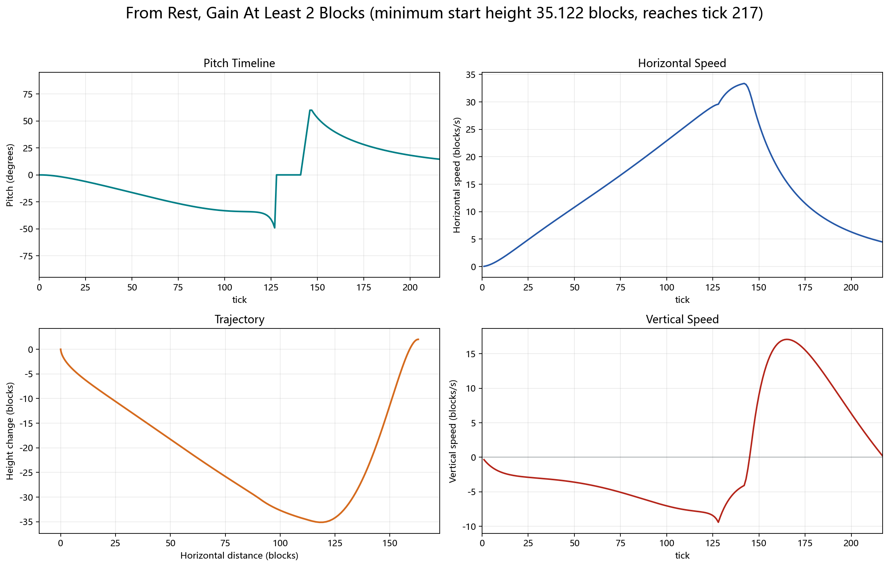
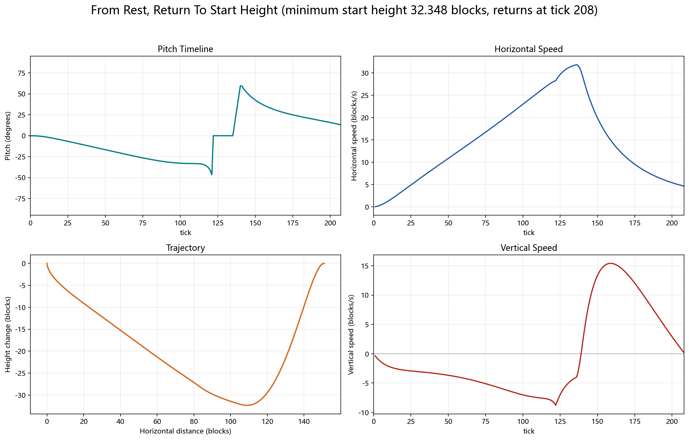
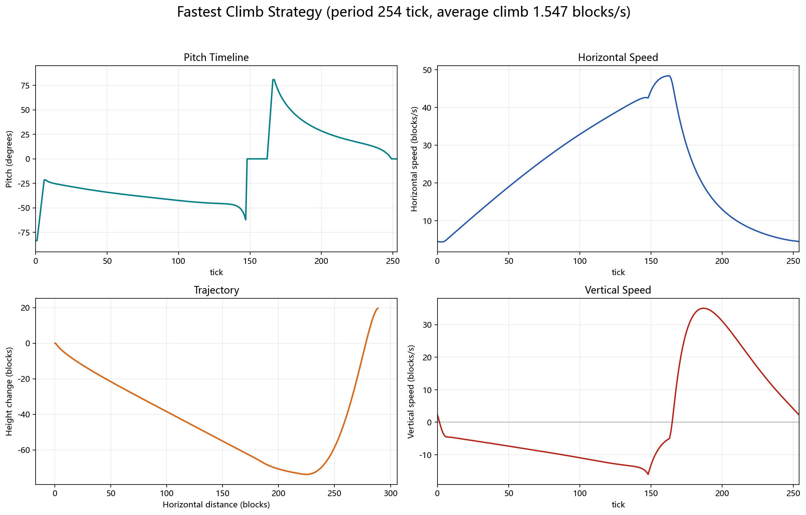
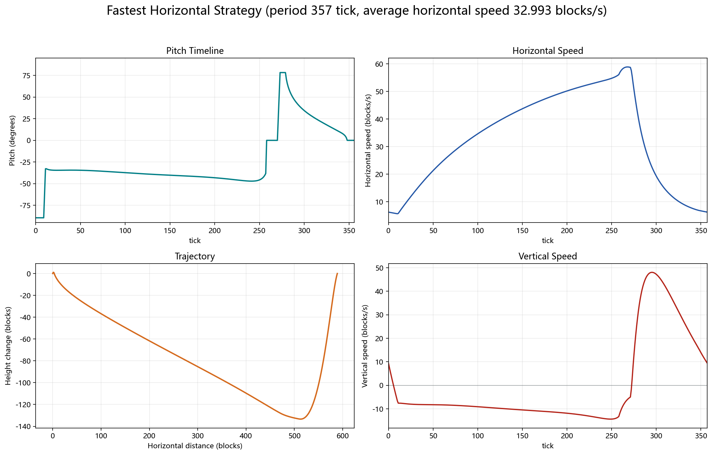

# Elytra Strategy Lab ([中文](README.zh-CN.md))

Optimized Minecraft Elytra pitch-control strategies, result data, plots, solvers, and a small Fabric client mod that applies selected pitch sequences while the player is already Elytra-flying.

The mod only changes the player's pitch angle. It does not directly edit position, velocity, durability, physics constants, or packets.

## Elytra tick model

The simulator uses a 2D version of the Java Edition Elytra tick formula with fixed yaw. Positive strategy angle means nose-up; Minecraft pitch uses the opposite sign:

```text
minecraft_pitch_degrees = -strategy_angle_degrees
```

The per-tick update is:

```text
lookH = cos(pitch)
lift = cos(pitch)^2 * min(1, |look| / 0.4)

vy += -0.08 + lift * 0.06

if (vy < 0) {
  yAccel = vy * -0.1 * lift
  vy += yAccel
  vx += yAccel
}

if (pitch < 0) {
  climb = |vx_old| * -sin(pitch) * 0.04
  vy += climb * 3.2
  vx -= climb
}

vx += (|vx_old| - vx) * 0.1
vx *= 0.9900000095367432
vy *= 0.9800000190734863
```

Sources and cross-checks:

- Minecraft Java client jar for version `26.2`, inspected locally through Fabric Loom cache.
- Fabric metadata: `https://meta.fabricmc.net/v2/versions/game` and `https://meta.fabricmc.net/v2/versions/loader/26.2`.
- Elytra behavior references: Minecraft Wiki and Yarn/LivingEntity-style mapping documentation for older mapped releases.

## General segmented strategy

The final hand-usable strategies use a segmented pitch curve:

1. negative-angle hold
2. linear transition into a negative Bezier curve
3. negative Bezier curve
4. zero-angle hold
5. linear ramp to a positive angle
6. positive-angle hold
7. positive Bezier curve returning toward zero
8. final zero-angle hold

Both Bezier curves use 8 y-control points. Their x-control points are fixed and dense near both ends:

```text
x_i = 0.5 - 0.5 * cos(pi * i / (controlCount - 1))
```

The control points are allowed to be nonmonotone in angle.

## Current results

| Result | Summary | Data | Plot |
|---|---:|---|---|
| From rest, gain at least 2 blocks with minimum drop | minimum initial height `35.1216888246`, target `217 tick`, target x `162.930961` | `results/from-rest-gain-two` |  |
| From rest, return to original height with minimum drop | minimum initial height `32.3476213893`, return `208 tick`, return x `150.941124` | `results/from-rest-return-height` |  |
| Fastest steady-state climb rate | period `254 tick`, climb `1.547442 blocks/s`, dy `+19.652515`, horizontal `22.732565 blocks/s` | `results/fastest-climb-rate` |  |
| Fastest steady-state horizontal speed with nonnegative height | period `357 tick`, horizontal `32.993197 blocks/s`, dy `+0.0000608` | `results/fastest-horizontal-speed` |  |

Each result folder contains:

- `strategy.json`: canonical parameters and metrics.
- `waveform.csv`: expanded per-tick pitch waveform.
- `trajectory.csv`: simulated state samples.

For direct reuse, the four strategy parameter files and per-tick waveforms are also mirrored under `strategies/`:

- `strategies/*/parameters.json`
- `strategies/*/waveform.csv`
- `strategies/*/best_params.csv` for the two periodic segmented-search results

## Web simulator

The browser simulator source is under `simulator/`. Open `simulator/index.html` directly in a browser to run it locally. It embeds the four mirrored pitch waveforms through `simulator/strategies-data.js`, with CSV loading kept as a fallback for served copies. The scene uses an x/y coordinate grid and the real simulated trail instead of random waypoint rings.

## Fabric mod

The Fabric client mod, **Elytra Optima**, is under `mod/elytra-optima`.
The author shown in the mod metadata is `hzyhhzy`. The mod icon is referenced as `assets/elytra_optima/icon.png`, with a duplicate root `icon.png` included for launcher compatibility.
The current compiled jar is checked in under `dist/elytra-optima-1.0.0.jar`.

Supported version pins:

- Minecraft `26.2`
- Fabric Loader `0.19.3`
- Fabric API `0.154.0+26.2`
- Java `25`

Controls:

- `H`: toggle Elytra Optima. Every time it is turned on, the default strategy is **min-start-height launch (>35 m)**.
- `J`: cycle strategy.

Cycle order:

```text
min-start-height (>35 m) -> fastest climb (20 m/cycle, start >75 m) -> fastest horizontal (33 m/s, start >142 m) -> min-start-height (>35 m)
```

All three embedded mod strategies loop while Elytra Optima is enabled. The first one is the `217 tick` prefix of the from-rest gain +2 result, used as a repeating pitch cycle.

## Reproducing and extending

- `solvers/segmented_sampled_optimize.cpp`: segmented Bezier optimizer for periodic horizontal speed and climb-rate searches.
- `solvers/audit_segmented_local.cpp`: local auditor/refiner for segmented periodic candidates.
- `solvers/nonperiodic_return_optimize.cpp`: nonperiodic from-rest return/gain-target optimizer.
- `solvers/fourier_optimize.cpp`, `solvers/bspline_optimize.cpp`, `solvers/framewise_optimize.cpp`: exploratory parameterizations used before settling on the segmented curve.
- `scripts/plot_quadrants.py`: regenerate the Chinese and English quadrant plots from the CSV result files.

For the search narrative, see [docs/solver-method.md](docs/solver-method.md).
