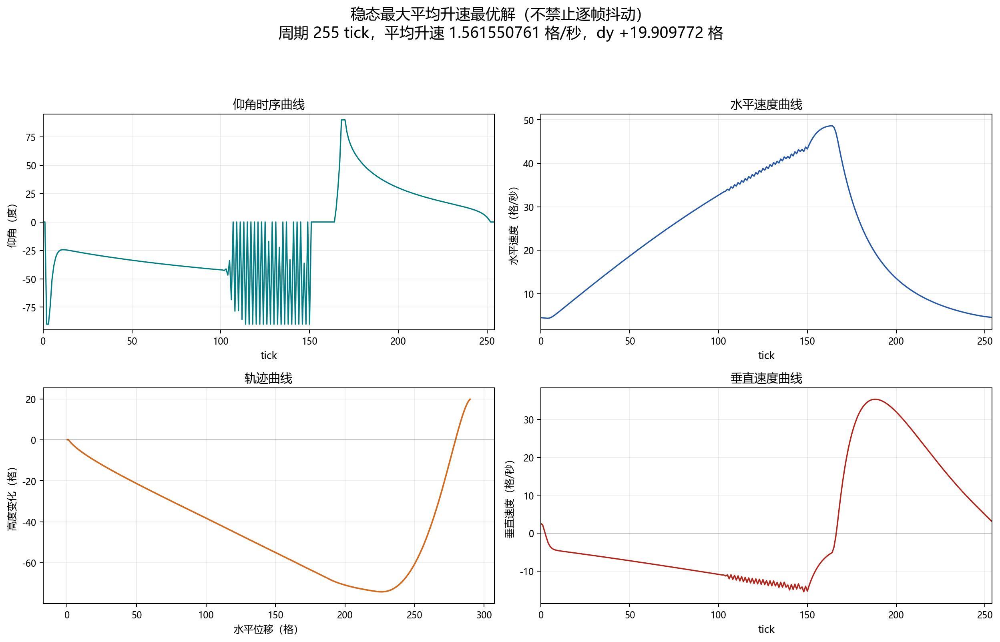
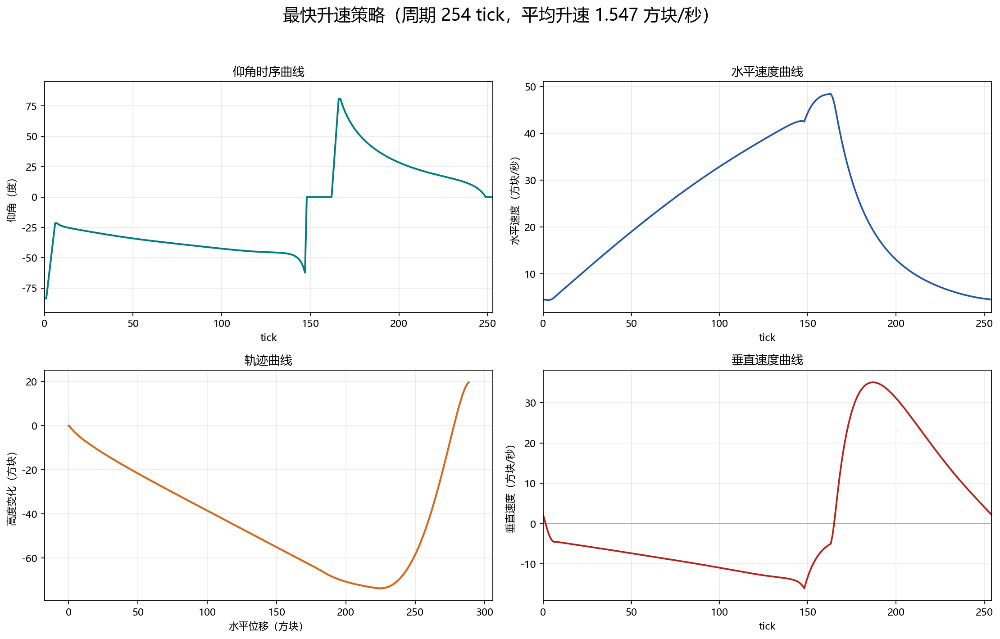
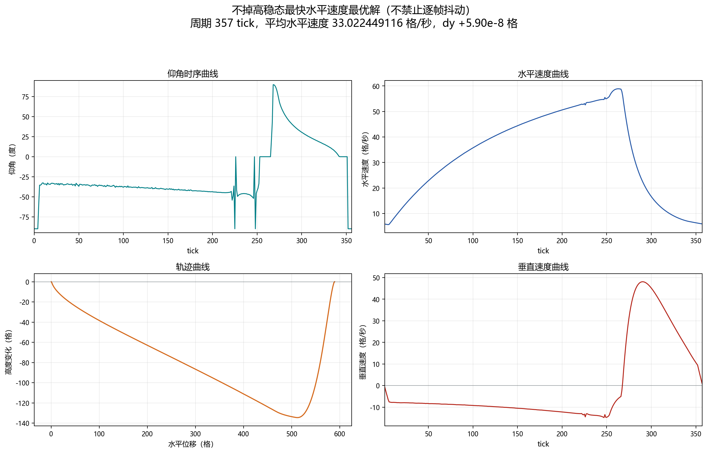
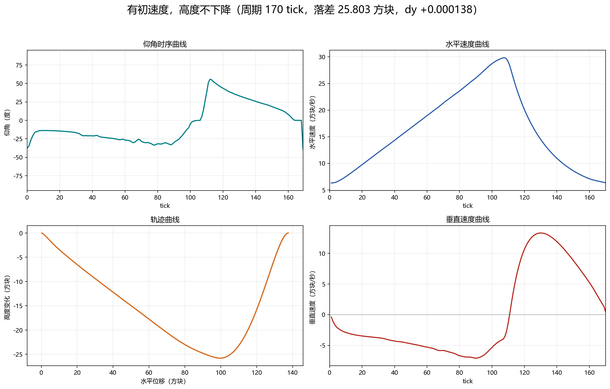
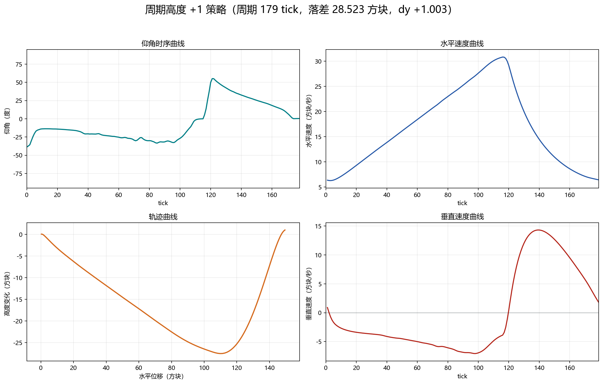
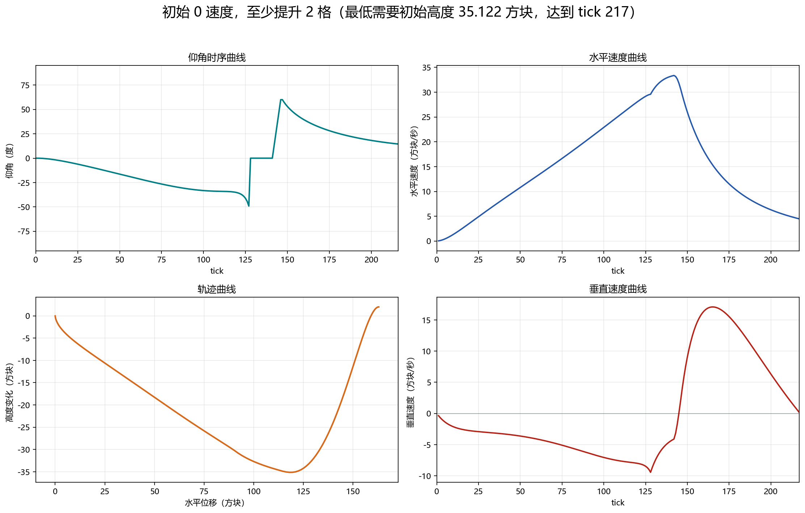
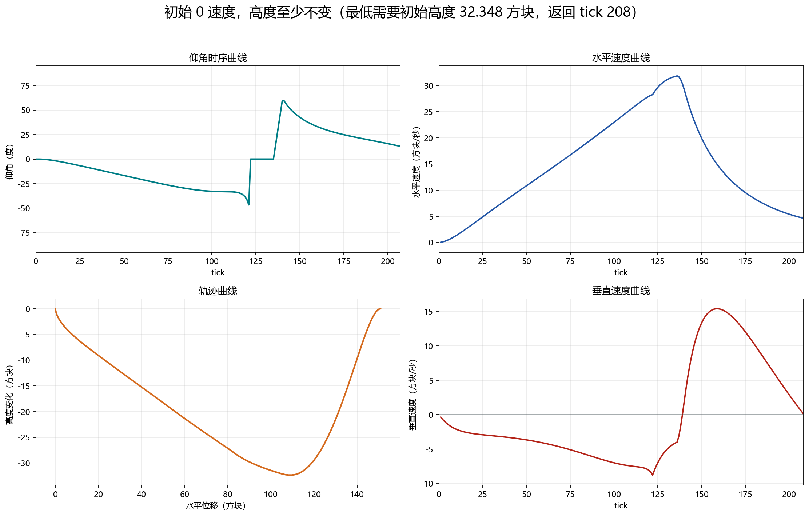

# 鞘翅策略实验室

这个仓库整理了 Minecraft 鞘翅俯仰角控制策略：优化结果、数据、四宫格图、求解器源码，以及一个 Fabric 客户端 mod。mod 会在玩家已经进入鞘翅飞行状态时按策略自动设置俯仰角。

mod 只改玩家俯仰角 `pitch`，不直接修改位置、速度、耐久、物理常数或网络包。

## 鞘翅 tick 模型

模拟器使用 Java 版鞘翅公式的二维版本，固定 yaw，只保留水平轴和垂直轴。策略里的正角度表示抬头，Minecraft pitch 的符号相反：

```text
minecraft_pitch_degrees = -strategy_angle_degrees
```

每 tick 更新公式：

```text
lookH = cos(pitch)
lift = cos(pitch)^2 * min(1, |look| / 0.4)

vy += -0.08 + lift * 0.06

if (vy < 0) {
  yAccel = vy * -0.1 * lift
  vy += yAccel
  vx += yAccel
}

if (pitch < 0) {
  climb = |vx_old| * -sin(pitch) * 0.04
  vy += climb * 3.2
  vx -= climb
}

vx += (|vx_old| - vx) * 0.1
vx *= 0.9900000095367432
vy *= 0.9800000190734863
```

来源和交叉检查：

- 本地通过 Fabric Loom cache 检查 Minecraft Java `26.2` client jar。
- Fabric metadata：`https://meta.fabricmc.net/v2/versions/game` 和 `https://meta.fabricmc.net/v2/versions/loader/26.2`。
- 鞘翅行为参考：Minecraft Wiki，以及旧映射版本的 Yarn/LivingEntity 文档。

## 搜索形态

逐帧 L-BFGS-B 可以找到这个仓库里目前升速最高的参考解，但不加约束时它经常会利用高频俯仰角抖动。这类结果能说明物理模型允许什么，但很难解释，也不适合作为直接使用的手工策略。更实用的版本通常需要加入平滑正则项，或者把控制压缩成低维、可读的曲线族。

为了可解释性，这里把逐帧搜索中观察到的形态整理成了 8 段俯仰角曲线：

1. 负角度保持
2. 线性衔接到负角度 Bezier 曲线
3. 负角度 Bezier 曲线
4. 0 度保持
5. 线性抬到正角度
6. 正角度保持
7. 正角度 Bezier 曲线回到 0 度
8. 末尾 0 度保持

两个 Bezier 段各有 8 个 y 控制点。x 控制点固定，并且在两端更密：

```text
x_i = 0.5 - 0.5 * cos(pi * i / (controlCount - 1))
```

控制点允许非单调。

## 当前结果

| 结果 | 摘要 | 数据 | 图 |
|---|---:|---|---|
| 逐帧 L-BFGS-B 最大升速原始参考解 | 周期 `255 tick`，升速 `1.562324772 方块/秒`，dy `+19.919641`；有剧烈抖动 | `results/lbfgsb-max-climb-raw` |  |
| 可解释分段最快升速 | 周期 `254 tick`，升速 `1.547442 方块/秒`，dy `+19.652515`，水平速度 `22.732565 方块/秒` | `results/fastest-climb-rate` |  |
| 平衡周期下高度不下降时最快水平速度 | 周期 `357 tick`，水平速度 `32.993197 方块/秒`，dy `+0.0000608` | `results/fastest-horizontal-speed` |  |
| 有初速度，高度不下降 | 周期 `170 tick`，初始速度 `(0.317616, 0.021783)`，高度跨度 `25.803350`，dy `+0.000138` | `results/periodic-vx025-no-drop` |  |
| 有初速度，周期高度 +1 | 周期 `179 tick`，初始速度 `(0.321915, 0.089330)`，高度跨度 `28.522724`，dy `+1.003298` | `results/periodic-gain-one` |  |
| 初始 0 速度，至少提升 2 格，最低下降高度 | 最低初始高度 `35.1216888246`，达到 `217 tick`，x `162.930961` | `results/from-rest-gain-two` |  |
| 初始 0 速度，高度至少不变，最低下降高度 | 最低初始高度 `32.3476213893`，返回 `208 tick`，x `150.941124` | `results/from-rest-return-height` |  |

逐帧 L-BFGS-B 原始解在 burn-in 到周期平衡速度后，把每个 tick 的仰角都作为变量优化：`0..164 tick` 限制为低头或水平，`165..254 tick` 限制为抬头或水平。它的逐帧仰角变化 RMS 约为 `36.16 度/tick`，最大跳变为 `90 度/tick`。分段最快升速略慢一些，但它是这个项目后续采用的 8 段可解释版本。复现原始搜索的脚本是 `solvers/lbfgsb_max_climb.py`。

每个结果目录都包含：

- `strategy.json`：规范化策略参数和指标。
- `waveform.csv`：展开后的逐 tick 仰角曲线。
- `trajectory.csv`：模拟轨迹状态。

为了方便直接复用，可部署策略的参数文件和逐 tick 时序也镜像到了 `strategies/`：

- `strategies/*/parameters.json`
- `strategies/*/waveform.csv`
- 两个周期分段搜索结果还包含 `strategies/*/best_params.csv`

## 网页模拟器

浏览器模拟器源码放在 `simulator/`。直接用浏览器打开 `simulator/index.html` 就能本地运行。部分镜像 pitch 时序通过 `simulator/strategies-data.js` 内置，CSV 加载保留为服务器运行时的 fallback。场景里使用 x/y 坐标网格和真实模拟轨迹，不再生成随机路点圆环。

## Fabric mod

Fabric 客户端 mod **Elytra Optima** 位于 `mod/elytra-optima`。
mod metadata 中显示的作者是 `hzyhhzy`。图标引用路径是 `assets/elytra_optima/icon.png`，同时保留根目录 `icon.png` 以兼容启动器读取。
当前编译好的 jar 放在 `dist/elytra-optima-1.0.0.jar`。

版本：

- Minecraft `26.2`
- Fabric Loader `0.19.3`
- Fabric API `0.154.0+26.2`
- Java `25`

按键：

- `H`：开关 Elytra Optima。每次刚开启时会选择配置里的默认策略；出厂默认是“起步+0（>32m）”。
- `J`：切换策略。默认策略和切换顺序可以通过 Mod Menu 设置按钮配置，也可以直接改 `config/elytra-optima.json`。

默认切换顺序：

```text
起步+0（>32m） -> 起步+2（>35m） -> 有初速不掉高（落差26m） -> 高度+1（落差28m） -> 平滑最大提升速度（20m/cycle，起步高度>75m） -> 抖动最大提升速度（20m/cycle，起步高度>75m） -> 最快水平速度（33m/s，起步高度>142m）
```

mod 内置策略都以逐帧 CSV 资源保存，并且会在 Elytra Optima 开启时循环。

## 复现和继续搜索

- `solvers/segmented_sampled_optimize.cpp`：周期平衡下的分段 Bezier 搜索，目标包括最快水平速度和最快升速。
- `solvers/audit_segmented_local.cpp`：周期候选解的局部审核/细化。
- `solvers/nonperiodic_return_optimize.cpp`：初始 0 速度的非周期返回/提升目标搜索。
- `solvers/lbfgsb_max_climb.py`：逐帧 L-BFGS-B 原始最大升速参考解的复现脚本。
- `solvers/fourier_optimize.cpp`、`solvers/bspline_optimize.cpp`、`solvers/framewise_optimize.cpp`：早期探索用的傅里叶、B-spline、逐帧参数化。
- `scripts/plot_quadrants.py`：从 CSV 结果重新生成中英文四宫格图。
- `scripts/plot_lbfgsb_max_climb_raw.py`：重新生成逐帧 L-BFGS-B 原始解的中英文四宫格图。

求解路线见 [docs/solver-method.md](docs/solver-method.md)。
