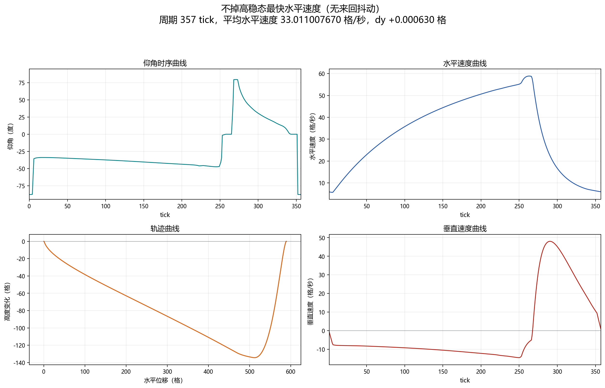

# 鞘翅策略实验室

这个仓库整理了 Minecraft 鞘翅俯仰角控制策略：优化结果、数据、四宫格图、求解器源码，以及一个 Fabric 客户端 mod。mod 会在玩家已经进入鞘翅飞行状态时按策略自动设置俯仰角。

mod 只改玩家俯仰角 `pitch`，不直接修改位置、速度、耐久、物理常数或网络包。

## 鞘翅 tick 模型

模拟器使用 Java 版鞘翅公式的二维版本，固定 yaw，只保留水平轴和垂直轴。策略里的正角度表示抬头，Minecraft pitch 的符号相反：

```text
minecraft_pitch_degrees = -strategy_angle_degrees
```

每 tick 更新公式：

```text
lookH = cos(pitch)
lift = cos(pitch)^2 * min(1, |look| / 0.4)

vy += -0.08 + lift * 0.06

if (vy < 0) {
  yAccel = vy * -0.1 * lift
  vy += yAccel
  vx += yAccel
}

if (pitch < 0) {
  climb = |vx_old| * -sin(pitch) * 0.04
  vy += climb * 3.2
  vx -= climb
}

vx += (|vx_old| - vx) * 0.1
vx *= 0.9900000095367432
vy *= 0.9800000190734863
```

来源和交叉检查：

- 本地通过 Fabric Loom cache 检查 Minecraft Java `26.2` client jar。
- Fabric metadata：`https://meta.fabricmc.net/v2/versions/game` 和 `https://meta.fabricmc.net/v2/versions/loader/26.2`。
- 鞘翅行为参考：Minecraft Wiki，以及旧映射版本的 Yarn/LivingEntity 文档。

## 搜索形态

逐帧优化可以找到性能最强的参考解，但在离散 tick 系统中，最优控制可能会主动利用高频俯仰角交替。这个仓库因此为最大升速和最快水平速度各保留两个版本：

- **最优解（不禁止逐帧抖动）**：完全不加平滑惩罚；
- **无来回抖动实用解**：保留真正的阶段跳变，只消除短时间内反复切换的俯仰角。

升速无抖解采用不分段的逐帧 L-BFGS-B、反转正则和 Java 精确坐标精修，并将整周期限制为四次仰角方向变化；水平无抖解采用 TV 趋势滤波、低频修正和短区间单调衔接。两者都不会把整条曲线模糊掉：最优鞘翅周期中确实可能存在有意义的不连续跳变，这些跳变会原样保留。早期使用的傅里叶和 B-spline 实验仍保留在 `solvers/`，方法过程见 [docs/solver-method.md](docs/solver-method.md)。

## 当前结果

| 结果 | 摘要 | 数据 | 图 |
|---|---:|---|---|
| 有初速度的最低起步高度（本身平滑） | 周期 `162 tick`，初始速度 `(0.332244, 0.079996)`，高度起伏 `25.560603`，dy `+4.31e-8` | `results/periodic-vx025-no-drop` |  |
| 最大平均升速最优解（不禁止逐帧抖动） | 周期 `255 tick`，升速 `1.561550761 格/秒`，dy `+19.909772`；环形 RMS 帧差 `36.086 度/tick` | `results/lbfgsb-max-climb-raw` |  |
| 最大平均升速，无来回抖动 | 周期 `254 tick`，升速 `1.552981247 格/秒`，dy `+19.722862`；不分段逐帧曲线，循环计有四次方向变化 | `results/fastest-climb-rate` |  |
| 不掉高最快水平速度最优解（不禁止逐帧抖动） | 周期 `357 tick`，水平速度 `33.022449116 格/秒`，dy `+5.90e-8` | `results/fastest-horizontal-speed` |  |
| 不掉高最快水平速度，无来回抖动 | 周期 `357 tick`，水平速度 `33.011007670 格/秒`，dy `+0.000630`；只慢 `0.03465%` | `results/fastest-horizontal-speed-smooth` |  |

以上五条主策略都使用 Java 精确的 `Mth.sin/cos` 查表行为验证。旧的连续三角函数升速数字 `1.562324772 格/秒` 不再作为可部署指标：精确 `+90 度` 位于查表边界。当前抖动升速解避开了该边界，在 Java 精确模型中达到 `1.561550761 格/秒`。

所有可部署周期波形都经过相位旋转，使 tick `0` 对应稳态轨迹的最高点。如果最高点位于周期末，那么它与下一周期 tick `0` 是同一控制相位，不需要实际旋转数组。

每个结果目录都包含：

- `strategy.json`：规范化策略参数和指标。
- `waveform.csv`：展开后的逐 tick 仰角曲线。
- `trajectory.csv`：模拟轨迹状态。

为了方便直接复用，可部署策略的参数文件和逐 tick 时序也镜像到了 `strategies/`：

- `strategies/*/parameters.json`
- `strategies/*/waveform.csv`
- `strategies/*/best_params.csv`

## 网页模拟器

浏览器模拟器源码放在 `simulator/`。直接用浏览器打开 `simulator/index.html` 就能本地运行。部分镜像 pitch 时序通过 `simulator/strategies-data.js` 内置，CSV 加载保留为服务器运行时的 fallback。场景里使用 x/y 坐标网格和真实模拟轨迹，不再生成随机路点圆环。

## Fabric mod

Fabric 客户端 mod **Elytra Optima** 位于 `mod/elytra-optima`。
mod metadata 中显示的作者是 `hzyhhzy`。图标引用路径是 `assets/elytra_optima/icon.png`，同时保留根目录 `icon.png` 以兼容启动器读取。
当前编译好的 jar 放在 `dist/elytra-optima-1.0.0.jar`。

版本：

- Minecraft `26.2`
- Fabric Loader `0.19.3`
- Fabric API `0.154.0+26.2`
- Java `25`

按键：

- `H`：开关 Elytra Optima。每次刚开启时会选择配置里的默认策略；出厂默认是“起步+0（>32m）”。
- `J`：切换策略。默认策略和切换顺序可以通过 Mod Menu 设置按钮配置，也可以直接改 `config/elytra-optima.json`。

默认切换顺序：

```text
起步+0（>32m） -> 起步+2（>35m） -> 有初速最低起步（25.56m） -> 高度+1（落差28m） -> 无抖最大升速（1.553m/s） -> 最大升速最优解（不禁止逐帧抖动，1.562m/s） -> 无抖最快水平（33.011m/s） -> 最快水平最优解（不禁止逐帧抖动，33.022m/s）
```

mod 内置策略都以逐帧 CSV 资源保存，并且会在 Elytra Optima 开启时循环。周期策略统一从最高点相位开始。

## 复现和继续搜索

- `solvers/segmented_sampled_optimize.cpp`：周期平衡下的分段 Bezier 搜索，目标包括最快水平速度和最快升速。
- `solvers/audit_segmented_local.cpp`：周期候选解的局部审核/细化。
- `solvers/nonperiodic_return_optimize.cpp`：初始 0 速度的非周期返回/提升目标搜索。
- `solvers/lbfgsb_max_climb.py`：逐帧 L-BFGS-B 原始最大升速参考解的复现脚本。
- `solvers/milp_exact_objective_refine.py`：最大升速和约束水平速度的 Java 精确多帧组合微调。
- `solvers/structural_period_exact.py`：通过插入/删除帧延拓到相邻周期长度。
- `solvers/optimize_smooth_correction.py`：用于无抖版本的跳变保留 TV 与低频修正。
- `solvers/fourier_optimize.cpp`、`solvers/bspline_optimize.cpp`、`solvers/framewise_optimize.cpp`：早期探索用的傅里叶、B-spline、逐帧参数化。
- `scripts/refresh_latest_strategy_metadata.py`：从仓库内 CSV 重新计算规范化指标和镜像策略 metadata。
- `scripts/rotate_periodic_results_to_highest.py`：把可部署周期波形统一到最高点相位。
- `scripts/plot_latest_three_tasks.py`：重新生成当前三项任务的中英文四宫格图。

通用求解路线见 [docs/solver-method.md](docs/solver-method.md)。当前“平衡周期不掉高时最小高度差”任务采用的稳健算法、经验总结和失败方向见 [docs/minimum-height-span-optimization.md](docs/minimum-height-span-optimization.md)。
