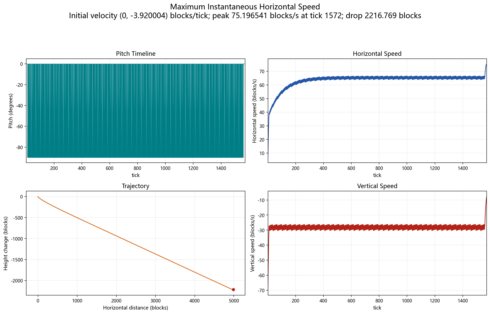
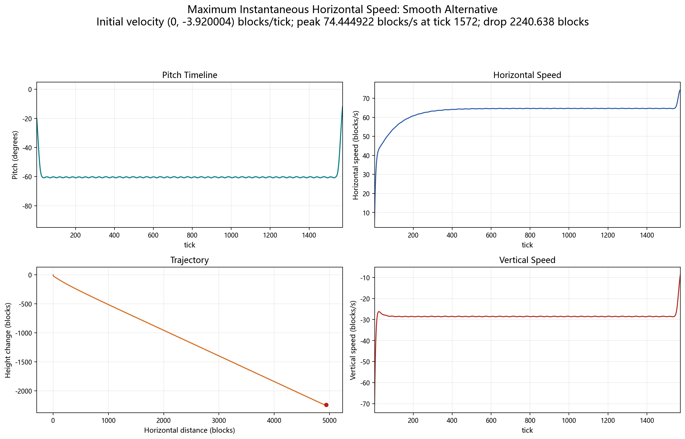

# Maximum Instantaneous Horizontal Speed

This note records a nonperiodic velocity-reachability side study. It asks for
the largest horizontal speed that can occur at any single tick when height and
elapsed time are unbounded.

This is not the same objective as the repository's fastest non-dropping
horizontal cycle. That headline task maximizes average speed while requiring
nonnegative height change. The present task permits a drop of thousands of
blocks to maximize one instantaneous value.

## Initial state and assumptions

- Initial velocity: `(vx, vy) = (0, -3.920003814700875) blocks/tick`.
- The vertical component is the limiting terminal velocity after an arbitrarily
  long vertical dive. It avoids attaching an arbitrary warm-up length to the
  reachability search.
- Initial position is `(x, y) = (0, 0)`; only velocity matters to the objective.
- Tick rate: `20 tick/s`.
- Height, elapsed time, and terminal state are unrestricted.
- Search pitch range: `[-90, +90] degrees`.
- Final replay uses the repository's Java-exact float constants and
  `Mth.sin/cos` lookup behavior.

The terminal-dive initial condition is a limiting state, not a finite from-rest
launch. A sufficiently long vertical pre-dive from rest can approach it as
closely as desired while consuming correspondingly more altitude.

## Results

| Variant | Peak horizontal speed | Peak tick | Height change | Pitch-delta RMS |
|---|---:|---:|---:|---:|
| Deterministic switching path | `75.196540693 blocks/s` | `1572` | `-2216.768699 blocks` | `62.360332 degrees/tick` |
| Smooth `cos^2` alternative | `74.444921694 blocks/s` | `1572` | `-2240.638356 blocks` | `0.323445 degrees/tick` |

The smooth alternative loses `0.751618999 blocks/s`, or `0.99954%`, while
reducing the largest one-tick pitch change from `90 degrees` to
`2.280445 degrees`.

## Reachability search

### Velocity-grid BFS

The first global search discretized the `(vx, vy)` reachable set and propagated
every one-degree pitch action. Retaining the best representative in each cell
gave increasingly strong constructive lower bounds as the velocity grid was
refined:

| Velocity cell size | Best speed found |
|---:|---:|
| `0.0005` | `75.153067611 blocks/s` |
| `0.00025` | `75.175532372 blocks/s` |
| `0.000125` | `75.189797789 blocks/s` |

The finest run visited about `741 million` cells, so further uniform refinement
was not a practical route.

### Convex-hull boundary propagation

The second solver propagated only the convex boundary of reachable velocity
states. For a fixed pitch and branch, the tick map is affine in velocity; the
convex hull therefore gives an efficient relaxation of the full reachable set.
The search was run with one-degree and half-degree pitch grids, with protected
right-edge hull simplification.

The unsimplified one-degree relaxation reached
`75.196544685 blocks/s`. A traced simplified run produced a fully deterministic
1572-tick predecessor chain. Java-exact replay of that actual chain reaches
`75.196540693 blocks/s`, leaving only `0.000003993 blocks/s` between the
constructive result and the best relaxed boundary value.

The traced path originally used both signs of vertical pitch. Replacing every
`+90-degree` frame with `-90 degrees` preserved the reported exact trajectory.
The published waveform is consequently easier to interpret:

- `1173` frames at `-90 degrees`;
- `398` frames at `0 degrees`;
- one frame at `-59 degrees`.

This high-frequency duty-cycle behavior is consistent with the other
discrete-time objectives in this repository: alternating endpoint controls can
slightly outperform an intermediate continuous angle.



## Smooth comparison

Directly averaging pitch is physically misleading because the dominant lift
term is approximately `cos^2(pitch)`. The smooth comparison therefore applies
a Gaussian filter with `sigma=8 tick` to

```text
q_t = cos(pitch_t)^2
```

and maps back through the negative-pitch branch:

```text
pitch_t = -acos(sqrt(q_t))
```

The resulting curve stays between `-60.838525` and `-11.933566 degrees`, has a
maximum pitch change of `2.280445 degrees/tick`, and reaches
`74.444921694 blocks/s`. It is a practical smoothing comparison, not a claim of
global optimality among all smooth controls.



## Artifacts and reproduction

Constructive switching result:

- [`results/peak-horizontal-speed/waveform.csv`](../results/peak-horizontal-speed/waveform.csv)
- [`results/peak-horizontal-speed/trajectory.csv`](../results/peak-horizontal-speed/trajectory.csv)
- [`results/peak-horizontal-speed/strategy.json`](../results/peak-horizontal-speed/strategy.json)
- [`results/peak-horizontal-speed/validation/`](../results/peak-horizontal-speed/validation/)

Smooth comparison:

- [`results/peak-horizontal-speed-smooth/waveform.csv`](../results/peak-horizontal-speed-smooth/waveform.csv)
- [`results/peak-horizontal-speed-smooth/trajectory.csv`](../results/peak-horizontal-speed-smooth/trajectory.csv)
- [`results/peak-horizontal-speed-smooth/strategy.json`](../results/peak-horizontal-speed-smooth/strategy.json)
- [`results/peak-horizontal-speed-smooth/comparison.json`](../results/peak-horizontal-speed-smooth/comparison.json)
- [`results/peak-horizontal-speed-smooth/sigma_sweep.csv`](../results/peak-horizontal-speed-smooth/sigma_sweep.csv)

Representative sources:

- [`solvers/reachable_peak_speed_convex.cpp`](../solvers/reachable_peak_speed_convex.cpp)
- [`solvers/reachable_peak_speed_bfs.cpp`](../solvers/reachable_peak_speed_bfs.cpp)
- [`solvers/smooth_cos2_strategy.py`](../solvers/smooth_cos2_strategy.py)
- [`scripts/plot_peak_horizontal_speed.py`](../scripts/plot_peak_horizontal_speed.py)
- [Chinese switching-path plot](images/peak-horizontal-speed.png)
- [Chinese smooth-alternative plot](images/peak-horizontal-speed-smooth.png)

## Confidence and limitations

The tiny relaxed-to-constructive gap, agreement between the half-degree and
one-degree searches, and exact deterministic replay are strong numerical
evidence. They are not a formal global proof over continuous pitch and infinite
time. The convex hull can contain mixed states that are not themselves
reachable, which is why the deterministic traced path is reported separately
from the slightly higher relaxed boundary.

## 中文摘要

这项支线研究的目标是“不限制高度和时间时，某一个 tick 能达到的最大水平
速度”。它与主线的“不掉高周期平均速度”不是同一个指标。

初态采用理想化的竖直终端下落速度
`(vx, vy)=(0, -3.920003814700875) 格/tick`。这相当于无限长竖直俯冲后的
极限状态；从静止出发只能通过越来越长的预俯冲逼近它。

- 确定性高频切换路径在第 `1572 tick` 达到
  `75.196540693 格/秒`，累计下降 `2216.768699 格`。时序包含 1173 帧
  `-90 度`、398 帧 `0 度` 和一帧 `-59 度`。
- 对 `cos^2(pitch)` 进行 `sigma=8 tick` 的高斯平滑后，峰值为
  `74.444921694 格/秒`，只低 `0.99954%`；最大帧间角度变化从 `90 度`
  降到 `2.280445 度`。
- 一度角凸包松弛的边界值为 `75.196544685 格/秒`，与可确定性重放的
  路径只差 `0.000003993 格/秒`。这是很强的数值证据，但不是连续控制和
  无限时域上的形式化全局最优证明。
