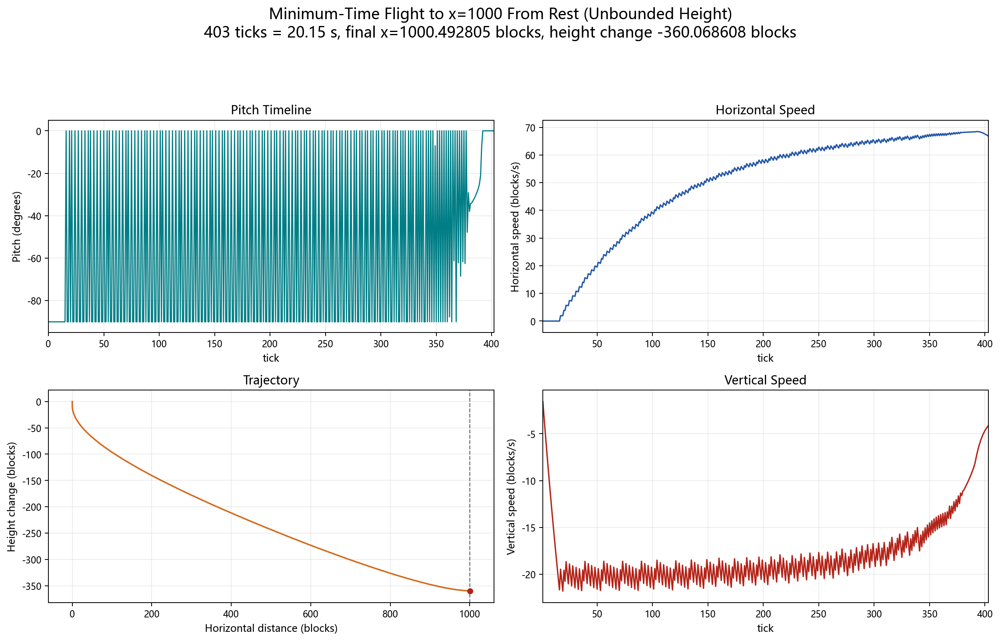
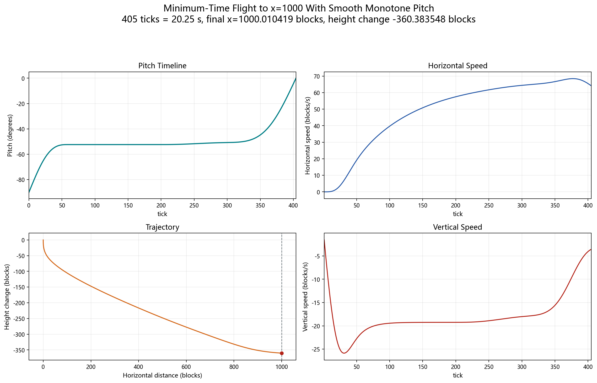

# Minimum-Time Flight to x=1000

This note records two nonperiodic side studies using the repository's
two-dimensional Java-exact Elytra model. Both tasks start from rest at the
origin and minimize the first tick at which `x >= 1000`.

## Shared assumptions

- Initial state: `x=0`, `y=0`, `vx=0`, `vy=0`.
- Tick rate: `20 tick/s`.
- Fixed yaw and two-dimensional motion.
- No ground, minimum-altitude, terminal-height, or terminal-speed constraint.
- Final validation uses Minecraft's float constants and `Mth.sin/cos` lookup
  behavior.
- Positive strategy angle means nose-up; Minecraft pitch has the opposite
  sign.

The absence of a ground constraint matters: both solutions descend by about
`360 blocks` while accelerating toward the target.

## Results at a glance

| Task | Arrival | Time | Final x | Height change | Final horizontal speed |
|---|---:|---:|---:|---:|---:|
| Unrestricted per-frame control | `403 tick` | `20.15 s` | `1000.492805296` | `-360.068607523` | `66.861897861 blocks/s` |
| Smooth monotone pitch | `405 tick` | `20.25 s` | `1000.010419371` | `-360.383548038` | `64.138202139 blocks/s` |

## Task 1: unrestricted per-frame control

Pitch may change independently every tick in `[-90, +90] degrees`. No
smoothness or monotonicity constraint is imposed.

The best Java-exact policy reaches the target at tick `403`. Its control is
mostly a high-frequency duty cycle between approximately `-89.99 degrees` and
`0 degrees`, with a small number of intermediate values. This is a legitimate
discrete-time optimum candidate, but it is not intended as a practical player
input sequence.

The first search used multi-start per-frame L-BFGS-B. A stronger boundary check
then exploited the triangular nose-down dynamics:

```text
V_k(vx, vy) = a_k * vx + b_k(vy)
```

This reduces fixed-horizon dynamic programming to a one-dimensional `vy` grid.
At 402 ticks, increasing the state and control resolution converged to a policy
rollout near `997.156174 blocks`; continuous and Java-exact local refinement
still remained about `2.844 blocks` short. Full-angle searches with injected
positive-pitch controls did not improve the boundary result.



Artifacts:

- [`results/min-time-x1000-unrestricted/waveform.csv`](../results/min-time-x1000-unrestricted/waveform.csv)
- [`results/min-time-x1000-unrestricted/trajectory.csv`](../results/min-time-x1000-unrestricted/trajectory.csv)
- [`results/min-time-x1000-unrestricted/strategy.json`](../results/min-time-x1000-unrestricted/strategy.json)
- [`results/min-time-x1000-unrestricted/validation/`](../results/min-time-x1000-unrestricted/validation/)
- [Chinese four-panel plot](images/min-time-x1000-unrestricted.png)

## Task 2: smooth monotone pitch

This variant imposes all of the following control constraints:

- pitch starts at exactly `-90 degrees`;
- pitch never decreases;
- pitch ends at exactly `0 degrees`;
- the continuous control curve is a clamped cubic B-spline and is therefore C2
  between ticks.

Monotonicity is enforced structurally. The spline control increments are a
softmax distribution whose cumulative sum maps from `-90` to `0 degrees`, so
the optimizer cannot create a hidden reversal or overshoot.

For each fixed horizon, multi-start L-BFGS-B first maximized horizontal
distance. Increasing the spline resolution to 400 controls gave the following
boundary check:

| Horizon | Best Java-exact x found |
|---:|---:|
| `403 tick` | `996.020618751` |
| `404 tick` | `999.341614960` |
| `405 tick` | `1002.663266669` |

The final 405-tick representative does not maximize the extra distance. SLSQP
instead minimizes the mean squared second pitch difference subject to
`x >= 1000.01` in the differentiable model, using analytic gradients for both
distance and curvature. Spline-order continuation avoids the rough local
solutions produced by restarting high-order optimization from a maximum-distance
profile. The selected 160-control result has:

| Smoothness metric | Value |
|---|---:|
| Maximum pitch change | `1.279601043 degrees/tick` |
| RMS second difference | `0.011223408 degrees/tick^2` |
| Maximum absolute second difference | `0.034993024 degrees/tick^2` |

Independent Java-exact replay confirms that the first target crossing is tick
`405`, the endpoints are exactly `-90/0 degrees`, and every adjacent pitch
difference is nonnegative.



Artifacts:

- [`results/min-time-x1000-smooth-monotone/waveform.csv`](../results/min-time-x1000-smooth-monotone/waveform.csv)
- [`results/min-time-x1000-smooth-monotone/trajectory.csv`](../results/min-time-x1000-smooth-monotone/trajectory.csv)
- [`results/min-time-x1000-smooth-monotone/controls.csv`](../results/min-time-x1000-smooth-monotone/controls.csv)
- [`results/min-time-x1000-smooth-monotone/strategy.json`](../results/min-time-x1000-smooth-monotone/strategy.json)
- [`results/min-time-x1000-smooth-monotone/boundary_validation.json`](../results/min-time-x1000-smooth-monotone/boundary_validation.json)
- [Chinese four-panel plot](images/min-time-x1000-smooth-monotone.png)

## Confidence and limitations

The 402-tick dynamic-programming convergence for the unrestricted task and the
400-control boundary scan for the monotone task are strong numerical evidence,
not formal global-optimality proofs. Both final waveforms and trajectories are
checked in so the reported Java-exact terminal states can be independently
replayed.

## 中文摘要

这里记录了两个从静止出发、目标为最早到达 `x=1000` 的非周期支线任务。
两者都不限制高度，因此飞行过程中会下降约 `360 格`。

- 不限制逐帧抖动时，目前最优结果为 `403 tick`（`20.15 秒`）。时序主要在
  `-89.99 度` 和 `0 度` 之间高频切换；402 tick 的高分辨率动态规划和局部
  精修仍只能到约 `997.156174 格`。
- 要求从 `-90 度` 开始、沿 C2 三次 B-spline 单调递增到 `0 度` 时，结果为
  `405 tick`（`20.25 秒`）。404 tick 的 400 控制点搜索最多到
  `999.341615 格`；最终 405 tick 解进一步最小化了二阶差分，而不是追求
  多余的终点距离。

两项结论都是强数值证据，不是形式化的全局最优证明。上面的结果目录包含
完整仰角 CSV、逐 tick 轨迹、精确指标和中英文四宫格图。
